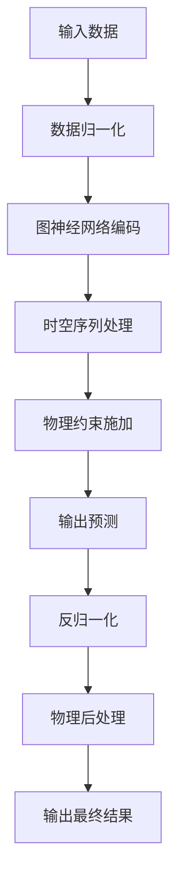

# emulator.py 详细解析

## 📜 文件概述

`emulator.py` 是 GNN-UDS 项目中用于构建排水系统**代理模拟器（surrogate emulator）**的核心模块。它不是一个物理模拟器，而是一个基于**图神经网络（GNN）+ 时序循环网络**的机器学习模型，用于**快速替代 SWMM 物理模型**进行排水系统的状态预测。

**核心用途：**
- 代替计算缓慢的 SWMM 物理模型，实现秒级预测
- 结合 GNN 处理排水系统的图拓扑结构
- 支持强化学习实时训练和控制优化
- 作为"数字孪生"的快速仿真引擎

## 🏗️ 系统架构

### 核心类结构

```python
class Emulator:
    def __init__(self, conv=None, resnet=False, recurrent=None, args=None):
        # 初始化所有参数...
    
    def build_network(self, conv=None, resnet=False, recurrent=None):
        # 构建神经网络模型...
    
    def fit_eval(self, x, a, b, y, ex, ey, fit=True):
        # 训练/评估模型...
    
    def predict(self, states, b, edge_state, a=None):
        # 预测系统状态...
```

### 数据维度说明

| 数据项 | 维度 | 含义 |
|--------|------|------|
| `states` | `(batch_size, seq_in, n_node, n_in)` | 节点状态序列 |
| `edge_state` | `(batch_size, seq_in, n_edge, e_in)` | 管道状态序列 |
| `b` | `(batch_size, seq_out, n_node, b_in)` | 边界条件（降雨/运行参数） |
| `a` | `(batch_size, seq_out, n_act)` | 控制动作（阀门/泵站开度） |
| `y` | `(batch_size, seq_out, n_node, n_out)` | 预测的节点状态 |
| `ey` | `(batch_size, seq_out, n_edge, e_out)` | 预测的管道状态 |

其中：
- `n_in` = 4（默认）：`[水深, 入流量, 出流量, 设置参数]`
- `n_out` = 3（默认）：`[水深, 入流量, 出流量]`
- `b_in` = 1（普通）或 2（有潮汐）：`[降雨量, (潮汐高度)]`
- `e_in` = 4（默认）：`[水深, 流速, 流量, 设置参数]`

## 🔄 工作流程



## 🧠 核心模块解析

### 1. 初始化模块 (`__init__`)

**功能：** 配置模型架构的所有超参数和物理约束

**关键参数：**
- **图卷积类型 (conv):** `GCNConv`, `GATConv`, `DiffusionConv`, `GeneralConv` 或 `None`
- **时序网络 (recurrent):** `GRU`, `LSTM`, `Conv1D` 或 `None`
- **残差连接 (resnet):** 启用残差网络结构
- **物理约束：**
  - `hmin`/`hmax`: 节点最小/最大水深
  - `ehmax`: 管道最大水深
  - `area`: 节点面积（用于质量平衡计算）
  - `pump`: 泵站额定流量
  - `is_outfall`: 是否为出水口节点
  - `tide`: 是否考虑潮汐边界

### 2. 神经网络构建模块 (`build_network`)

**这是最复杂的部分，实现多层次特征融合：**

#### (1) 嵌入层（Embedding Block）
```python
# 节点状态嵌入
x = reshape(X_in, (-1, n_node*n_in))
x = Dense(self.embed_size)(x)

# 边界条件嵌入
b = Dense(self.embed_size//2)(b)

# 管道状态嵌入
e = Dense(self.embed_size)(e)
```

#### (2) 空间处理层（Spatial Block）
- **图卷积混合：** 节点和管道特征的相互融合
- **边-节点交互：** 使用 `NodeEdge` 层实现节点和管道的特征传递
- **多种图卷积选择：**
  ```python
  if conv == 'GAT':
      net = MixedGAT(embed_size, activation=activation)
  elif conv == 'GCN':
      net = GCNConv(embed_size, activation=activation)
  ```

#### (3) 时序处理层（Temporal Block）
- **GRU/LSTM/Conv1D:** 处理时间序列依赖
- **因果卷积:** 保证时间因果性
- **序列滑动:** 输入序列长度 >= 输出序列长度

#### (4) 残差连接（ResNet Connection）
```python
# 恒等连接 + 累积求和 = 类似于 ResNet 的残差学习
x_out = Dense(self.embed_size, name='dense_resx')(x)
x = Add()([cumsum(x_out, axis=1), tile(res, ...)])
```

#### (5) 输出层
- **节点输出：** 水深、入流、出流、是否过载
- **管道输出：** 水深、流速、流量
- **激活函数选择：** `hard_sigmoid`（节点输出）、`tanh`（管道输出）

### 3. 物理后处理模块 (`post_proc` / `post_proc_tf`)

**这是最关键的部分，将神经网络输出转化成物理上有意义的结果：**

#### (1) 潮汐边界处理
```python
if self.tide:
    h = y[...,0] * (1 - self.is_outfall) + b[...,-1]
```

#### (2) 控制动作施加
- **泵站调节：** 根据控制动作调整泵站流量
- **阀门调节：** 根据控制动作调整阀门开度
- **额定流量限制：** 泵站流量不超过额定值

#### (3) 节点-管道流量平衡
```python
# 边到节点的流量聚合
node_outflow = matmul(clip(self.node_edge, 0, 1), clip(efl, 0, inf))
node_inflow = matmul(abs(clip(self.node_edge, -1, 0)), clip(efl, 0, inf))
```

#### (4) 管道入流延迟补偿
```python
# 当管道入流有偏移量时进行调整
inoff = matmul(y[...,0] - self.hmin, clip(self.node_edge, 0, 1))
flow = ey[...,-1] * (ey[...,-1] > 0) * (inoff > self.offset)
```

### 4. 物理约束模块 (`constrain` / `constrain_tf`)

**确保预测结果满足排水系统的物理规律：**

#### (1) 水深约束
```python
h = clip(h, self.hmin, self.hmax)  # 水深在合理范围内
```

#### (2) 质量平衡计算
```python
# 简化的质量平衡方程
q_w = clip(q_us + r - q_ds - dv, 0, inf) * (1 - self.is_outfall)
```
其中：
- `q_us`: 入流量
- `q_ds`: 出流量
- `r`: 降雨量
- `dv`: 蓄水量变化
- `q_w`: 溢流量（过载时的流量）

#### (3) 过载判断逻辑
```python
if self.if_flood:
    f = y[...,-1] > 0.5  # 过载概率 > 0.5
    h = self.hmax * f + h * ~f  # 过载时水深达到最大值
    q_w *= f  # 过载时产生溢流
```

### 5. 训练模块 (`fit_eval`)

**同时训练节点和管道的预测任务：**

#### (1) 多任务损失函数
- **节点损失:** 水深、流量的均方误差（加权）
- **管道损失:** 管道状态的均方误差
- **过载损失:** 二元交叉熵（过载预测）
- **梯度归一化（GradNorm）：** 自动平衡多任务训练的梯度

#### (2) 滚动预测（Rolling Forecast）
支持滚动预测（`self.roll > 0`），可以：
- 处理长序列预测
- 实现课程学习（由简到难）
- 减少误差累积

### 6. 预测模块 (`predict` / `simulate`)

**提供两种预测接口：**
- **`predict`:** 单次预测
- **`simulate`:** 长时间序列模拟

## 🎯 关键技术特点

### 1. 混合图神经网络架构
- **空间卷积：** GAT/GCN 处理拓扑结构
- **时序网络：** GRU/LSTM 处理时间序列
- **边-节点融合：** 双向特征传递机制

### 2. 物理信息嵌入（Physics-Informed）
- **约束后处理：** 确保预测的物理合理性
- **质量平衡：** 保持系统守恒
- **边界条件：** 正确施加降雨和潮汐

### 3. 控制动作整合
- **动作编码：** 将控制动作转换成图邻接矩阵变化
- **实时调节：** 模型可响应实时控制指令
- **多智能体：** 支持多个控制点协同

### 4. 高效并行计算
- **TensorFlow 优化：** 支持 GPU 加速
- **批次处理：** 支持批量预测
- **混合精度：** 减少显存占用

## 📊 输入/输出数据结构

### 输入数据准备
```python
# 节点状态 (states)
# 维度：[batch, time, node, features]
# features = [水深, 入流量, 出流量, 设置参数]

# 管道状态 (edge_state)
# 维度：[batch, time, edge, features]
# features = [水深, 流速, 流量, 设置参数]

# 边界条件 (b)
# 维度：[batch, time, node, features]
# features = [降雨量] 或 [降雨量, 潮汐高度]

# 控制动作 (a)
# 维度：[batch, time, n_actions]
```

### 输出解析
```python
# 模型预测结果
preds, edge_preds = emulator.predict(states, b, edge_state, a)

# preds: [水深, 入流量, 出流量, 是否过载?]
# edge_preds: [水深, 流速, 流量]
```

## 🔧 配置参数详解

| 参数名 | 类型 | 默认值 | 说明 |
|--------|------|--------|------|
| `conv` | str | None | 图卷积类型：'GCN', 'GAT', 'Diffusion', 'General' |
| `recurrent` | str | 'GRU' | 时序网络：'GRU', 'LSTM', 'Conv1D' |
| `embed_size` | int | 64 | 特征嵌入维度 |
| `hidden_dim` | int | 64 | 隐藏层维度 |
| `n_sp_layer` | int | 3 | 空间层数 |
| `n_tp_layer` | int | 2 | 时序层数 |
| `seq_in` | int | 6 | 输入时间步数 |
| `seq_out` | int | 1 | 输出时间步数 |
| `dropout` | float | 0.0 | 丢弃率 |
| `resnet` | bool | False | 是否使用残差连接 |
| `balance` | bool | False | 是否强制质量平衡 |
| `if_flood` | int | 0 | 是否预测过载（0=不预测,1=预测） |

## 🚀 使用方法示例

### 1. 初始化模拟器
```python
from emulator import Emulator
import argparse

args = argparse.Namespace(
    conv='GAT',
    resnet=True,
    recurrent='GRU',
    embed_size=128,
    hidden_dim=64,
    seq_in=6,
    seq_out=1,
    n_node=40,  # 排水系统节点数
    n_edge=45,  # 管道数
    # ... 其他物理参数
)

emulator = Emulator(conv='GAT', resnet=True, recurrent='GRU', args=args)
```

### 2. 训练模型
```python
# 加载归一化参数
emulator.set_norm(norm_x, norm_b, norm_y, norm_r, norm_e)

# 训练循环
for epoch in range(epochs):
    node_loss, edge_loss = emulator.fit_eval(x, a, b, y, ex, ey, fit=True)
```

### 3. 进行预测
```python
# 单步预测
preds, edge_preds = emulator.predict(states, rainfall, edge_state, control_actions)

# 长时间模拟
sim_results, edge_results = emulator.simulate(
    initial_states, 
    rainfall_scenario, 
    edge_states, 
    control_sequence
)
```

## 💡 项目集成建议

### 与 SWMM 的对比
| 特性 | SWMM 物理模型 | emulator 代理模型 |
|------|--------------|-------------------|
| 计算速度 | 慢（分钟级） | 快（秒级） |
| 精度 | 高（物理方程） | 较高（数据驱动） |
| 可微分 | 否 | 是（支持反向传播） |
| 控制优化 | 困难 | 容易（梯度优化） |
| 实时性 | 差 | 好 |

### 在强化学习中的应用
```python
# emulator 作为环境模型
class RLEnvironment:
    def __init__(self, emulator):
        self.emulator = emulator
    
    def step(self, action):
        # 使用 emulator 预测下一状态
        next_state = self.emulator.predict(current_state, rainfall, action)
        reward = calculate_reward(next_state)
        return next_state, reward, done, info
```

## 🐛 常见问题与调试

### 1. 训练不收敛
- **检查数据归一化：** 确保 `set_norm()` 正确调用
- **调整学习率：** 使用 `args.learning_rate` 参数
- **检查梯度：** 使用 TensorFlow 的 `GradientTape` 监控

### 2. 预测结果异常
- **验证后处理：** `post_proc` 函数是否被正确调用
- **检查物理约束：** `hmin`/`hmax` 等参数是否合理
- **调试数据流：** 打印中间结果的形状和范围

### 3. 内存溢出
- **减小批次大小：** 调整 `batch_size`
- **使用混合精度：** 启用 `mixed_precision`
- **优化图结构：** 简化排水系统拓扑

## 📈 扩展改进方向

### 1. 模型扩展
- **多头注意力：** 增强节点关系建模
- **图结构学习：** 自动学习邻接矩阵
- **不确定性估计：** 添加置信区间

### 2. 物理约束增强
- **动态约束：** 随时间变化的边界条件
- **复杂流态：** 非恒定流、湍流模拟
- **污染物传输：** 添加溶解氧、COD 等

### 3. 实时控制优化
- **模型预测控制（MPC）：** 集成滚动优化
- **自适应学习：** 在线更新模型参数
- **多目标优化：** 同时考虑内涝、污染、能耗

## 🔗 相关文件

1. **`predictor.py`** - 更简单的 GNN 预测器，功能是 emulator 的子集
2. **`dataloader.py`** - 数据预处理和加载
3. **`main.py`** - 主程序，协调训练和测试流程
4. **`config.yaml`** - 配置文件，定义所有参数

---

## 🎓 总结

`emulator.py` 是一个**物理信息增强的图神经网络模型**，它巧妙地将：
- **图神经网络** 的拓扑学习能力
- **循环神经网络** 的时序建模能力
- **排水系统** 的物理约束知识

结合在一起，创造了一个既**快速**又**物理合理**的 SWMM 替代模型。这是城市排水系统**数字孪生**和**智能控制**的核心引擎。

**最适合你的博士研究应用在：**
- ✅ **快速场景模拟：** 评估不同暴雨情景
- ✅ **控制策略测试：** 优化泵站/阀门调度
- ✅ **实时预测：** 集成气象预报的预警系统
- ✅ **强化学习：** 训练智能控制策略

这个模块的复杂度适中，但功能强大，非常适合作为你博士课题的技术基础。有什么具体想深入了解的部分吗？ 🦐